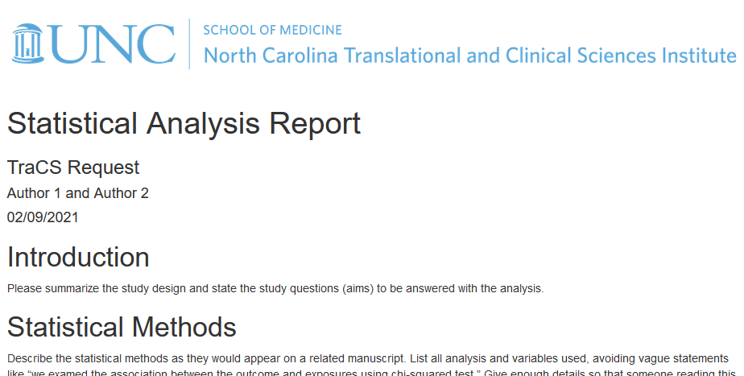
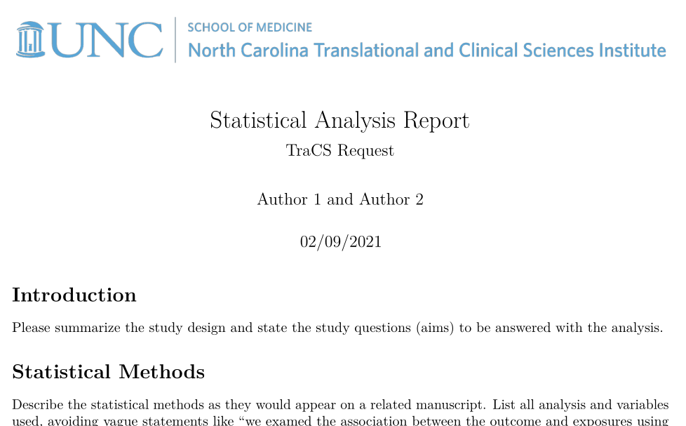
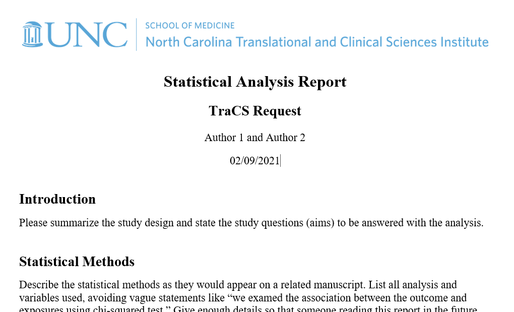

# BiosCoreHub

[](https://github.com/mkenney/software-guides/blob/master/STABILITY-BADGES.md#experimental)

The goal of BiosCoreHub is to assist NC TraCS Bios Core analysts by providing basic reporting tools for the most common statistical analysis requests.

## Installation

You can install the released version of BiosCoreHub from [CRAN](https://CRAN.R-project.org) with:

``` r
install.packages("BiosCoreHub")
```

## Example

HTML report template



<br>

PDF report template



<br>

Docx report template



