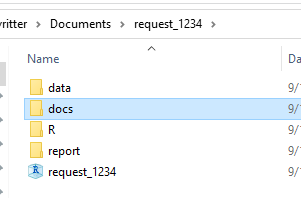

```{r, include = FALSE}
knitr::opts_chunk$set(
  collapse = TRUE,
  comment = "#>"
)
```

```{r setup}
library(BiosCoreHub)
```

## Use RStudio!

-   Latest versions of RStudio have many features that can help you writing your reports

    -   Markdown editor (new!)
    -   Templates for reports, papers, and presentations
    -   Spell checking
    -   Automation and reproducibility

## Project directory structure (optional)

-   Each request gets a new Rstudio project folder
-   Project's folder has subdirectories for general documents, data, scripts, and report (the report folder is created using the *BiosCoreHub* package).



## Workflow (optional)

-   Complicated analysis with multiple scripts are saved in the *R* directory and *sourced* when writing the RMarkdown script

    -   **Pros:** faster .Rmd compilation (can use knitr option *cache = TRUE*)
    -   **Pros:** cleaner .Rmd file
    -   **Cons:** .Rmd is not a standalone report anymore
    -   **Cons:** can be complicated to manage which codes to use on your report in case of multiple iterations

-   Example:

```{r eval=FALSE, include=TRUE}
knitr::opts_chunk$set(echo = FALSE, fig.align = "center")

# Load the packages you need
library(tidyverse)
library(flextable)

source('./R/analysis.R')
```

## Table 1 and Results

-   Package **gtsummary** has great capabilities
-   Remember to label your variables for nice outputs

{width="800"}

### Examples (straight from gtsummary's website [here](http://www.danieldsjoberg.com/gtsummary/))

#### Summary Table

Use *tbl_summary()* to summarize a data frame.

```{r echo=TRUE}
library(gtsummary)
# make dataset with a few variables to summarize
trial2 <- trial %>% select(age, grade, response, trt)

# summarize the data with our package
table1 <- tbl_summary(trial2)

table1
```

There are many customization options to add information (like comparing groups) and format results (like **bold** labels) in your table. See the *tbl_summary()* tutorial for many more options, or below for one example.

```{r echo=TRUE}
table2 <- 
  tbl_summary(
    trial2,
    by = trt, # split table by group
    missing = "no" # don't list missing data separately
  ) %>%
  add_n() %>% # add column with total number of non-missing observations
  add_p() %>% # test for a difference between groups
  modify_header(label = "**Variable**") %>% # update the column header
  bold_labels() 

table2
```

#### Regression Models

Use *tbl_regression()* to easily and beautifully display regression model results in a table. See the tutorial for customization options.

```{r echo=TRUE}
mod1 <- glm(response ~ trt + age + grade, trial, family = binomial)

t1 <- tbl_regression(mod1, exponentiate = TRUE)

t1
```

#### Side-by-side Regression Models

You can also present side-by-side regression model results using *tbl_merge()*

```{r echo=TRUE}
library(survival)

# build survival model table
t2 <-
  coxph(Surv(ttdeath, death) ~ trt + grade + age, trial) %>%
  tbl_regression(exponentiate = TRUE)

# merge tables 
tbl_merge_ex1 <-
  tbl_merge(
    tbls = list(t1, t2),
    tab_spanner = c("**Tumor Response**", "**Time to Death**")
  )

tbl_merge_ex1
```

#### Save Individual Tables

*gtsummary* tables can also be saved directly to file as an image, RTF, LaTeX, and Word file.

```{r eval=FALSE, include=TRUE}
tbl %>%
  as_flex_table() %>%
  flextable::save_as_docx()
```

#### Small fonts and themes

```{r echo=TRUE}
# If you want small fonts
table1 %>%
  as_gt() %>%
  gt::tab_options(table.font.size = "small")
```

```{r eval=FALSE, include=TRUE}
# JAMA theme
theme_gtsummary_journal(journal = "jama")
```

